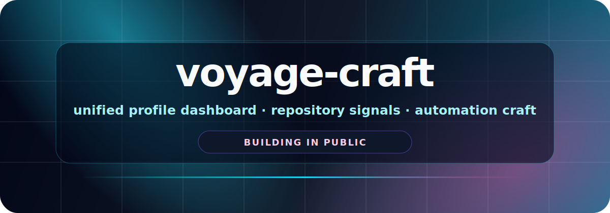
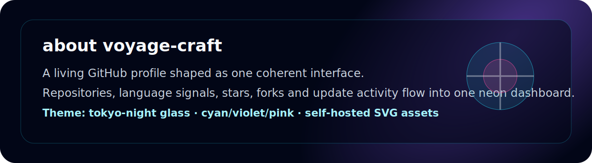
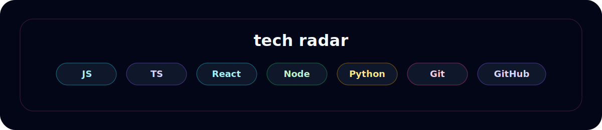

<b>voyage-craft · live dashboard</b>

<!-- PROFILE_SYNC_START -->

   

<h3>Activity Pulse</h3>
<h3>Repository Constellation</h3>
Sync pipeline armed. Repository cards, language signals, Stars and Forks will illuminate here on the next authenticated refresh.
Preview mode: waiting for authenticated data refresh.
<!-- PROFILE_SYNC_END -->

<b>voyage-craft · tech radar</b>

